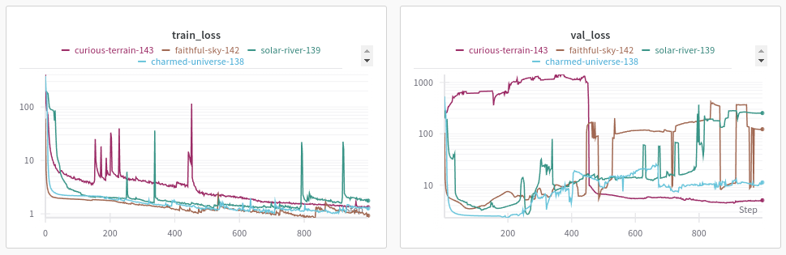

# Deep Learning in Signal Processing

This is repository is part of a special course at DTU, where the the objective is to get acquainted with some state of the art deep learning methods within signal processing and time series analysis. The study activities included study and discussion of the below papaers on a bi-weekly basis as well as reimplementation of selected methods.

Curriculum:
* Universal Time-Series Representation Learning: A Survey [1]
* Probabilistic Machine Learning: An Introduction (Chapter 15 - Sequences) [2]
* Attention is all you need [3]
* Connectionist Temporal Classification: Labelling Unsegmented Sequence Data with Recurrent Neural Networks [4]
* Supervised Sequence Labelling with Recurrent
Neural Networks (Chapter 7 -Connectionist Temporal Classification) [5]
* Wav2vec: Unsupervised Pre-training for Speech Recognition [6]
* Wav2vec 2.0: A Framework for Self-Supervised Learning of Speech Representations [7]

## Summary

### Reccurent Neural Networks:

* **Vanilla Recurrent Neural Network (RNN)**: They are designed to process sequences of data by maintaining a hidden state that is updated at each time step. This hidden state captures information from previous inputs in the sequence, allowing the network to model temporal dependencies. RNNs can struggle with long-term dependencies due to issues like vanishing and exploding gradients, making it hard for the network to learn from data that is far back in the sequence.

* **Gated Recurrent Unit (GRU)**: This method introduces gating mechanisms to control the flow of information, which helps mitigate the vanishing gradient problem. GRUs have two main gates: the reset gate and the update gate. The reset gate determines how much of the past information to forget, while the update gate controls how much of the new information to incorporate.

* **Long Short-Term Memory (LSTM)**: They are designed to remember information for long periods, addressing the vanishing gradient problem more effectively than standard RNNs. LSTMs have three main gates: the input gate, the forget gate, and the output gate. These gates regulate the flow of information into and out of the cell state, which serves as the network’s memory. LSTMs are particularly good at capturing long-term dependencies, making them suitable for tasks like language modeling and time-series prediction.

* **Backpropagation through time**: Training reccurent type of architectures involve unfolding the RNN in time and applying the chain rule for derivatives to compute the gradients for each time step.
The vanilla RNN can be expressed as folows (omitting the bias term for simplicity):

$$
\begin{align*}
h_t &= W_{hx} x_t + W_{hh}h_{t-1}\\
o_t &= W_{ho} h_t
\end{align*}
$$

where $x_t$ is the input sequence, $h_t$ is the hidden state and $o_t$ is the output sequence.The loss can be expressed using the true labels $y_t$ and the outputs $o_t$:

$$
\begin{align*}
L = \frac1T \sum_{t=1}^T l(y_t, o_t)
\end{align*}
$$

To find the derivative we use the chain rule:

$$
\begin{align*}
\frac{\partial L}{\partial w_h} = \frac1T \sum_{i=1}^T \frac{\partial l(y_t, o_t)}{\partial w_h} = \frac1T \sum_{i=1}^T \frac{\partial l}{\partial o_t} \frac{\partial o_t}{\partial h_t} \frac{\partial h_t}{\partial{w_t}}
\end{align*}
$$

where $w_h$ holds all trainable parameters. The first part is the gradient of the final loss (eg. softmax or MSE) and the second part is the output layer (like linear regression). We can see that the last term is recursive. If we expand it using the chain rule again we get:

$$
\begin{align*}
\frac{\partial h_t}{\partial{w_h}} = \frac{\partial h_t}{\partial w_h} + \frac{\partial h_t}{\partial h_{t-1}} \frac{\partial h_{t-1}}{\partial w_h}
\end{align*}
$$

to understand the recursion we can rename the terms and write out the expression for a couple of timesteps:

$$
\begin{align*}
a_t &= b_t + c_t a_{t-1} \\
a_1 &= b_1 \\
a_2 &= b_2 + c_2 a_1 = b_2 + c_2 b_1\\
a_3 &= b_3 + c_3 a_2 = b_3 + c_3 (b_2 + c_2 b_1) = b_3 + c_3 b_2 + c_3 c_2 b_1 \\
a_4 &= b_4 + c_4 b_3 + c_4 c_3 b_2 + c_4 c_3 c_2 b_1 \\
a_t &= b_t + \sum_{i=1}^{t-1} \left( \prod_{j=i+1}^t c_j \right) b_i
\end{align*}
$$

So the recursive part becomes:

$$
\begin{align*}
\frac{\partial h_t}{\partial{w_h}} = \frac{\partial h_t}{\partial w_h} + \sum_{i=1}^{t-1} \left( \prod_{j=i+1}^t \frac{\partial h_j}{\partial h_{j-1}} \right) \frac{\partial h_{i}}{\partial w_h}
\end{align*}
$$

### Transformers

* **Applications**: Transformers are effective for machine translation tasks, where the goal is to translate text from one language to another. Unlike RNNs, transformers do not require sequential processing, allowing them to process entire sentences simultaneously. This parallelism makes transformers faster and more efficient for training on large datasets.
* **Attention**: The attention mechanism enables the model to focus on relevant parts of the input sequence when generating each output element. It computes a set of attention weights that determine the importance of each input element relative to the current output. In transformers, self-attention allows the model to consider the relationships between all elements in the input sequence simultaneously. 
* **Architecture** : Transformers have two parts: The encoder processes the input sequence and generates a set of context vectors. It consists of multiple layers, each containing a self-attention mechanism followed by a feedforward neural network.
The decoder generates the output sequence by attending to the context vectors from the encoder and using its own self-attention mechanisms. It also consists of multiple layers, each containing self-attention, encoder-decoder attention, and feedforward neural networks. 

* **Positional Encoding**: Transformers use positional encoding to retain information about the order of the input sequence, as the self-attention mechanism itself does not inherently capture positional information. In practice this can sinusoidal encoding, so for example for odd words one would use:
$$PE_{(pos,2i+1)} =cos\left( \frac{pos}{10000\frac{2i}{d}}\right)$$
where d is the dimention of the embeddings (eg. 512)

Note that this part of the curriculum was introduced by Hiba Nassar [hibna@dtu.dk] and that the code example in `transformers/` is the result of a codalong by CodeEmporium ([Transformers from scratch](https://www.youtube.com/watch?v=QCJQG4DuHT0&list=PLTl9hO2Oobd97qfWC40gOSU8C0iu0m2l4))

### Connectionist Temporal Classification (CTC)
* **Applications**: CTC is used to train RNNs for labeling unsegmented sequence data, making it ideal for tasks like speech-to-text, where the alignment between the input audio and the output text is unknown.
* **Gradient Calculation**: Training with CTC involves calculating the gradient of the CTC loss function with respect to the network parameters. This process uses dynamic programming techniques to efficiently compute the probabilities of all possible label sequences and their alignments with the input sequence.
* **Forward-Backward Algorithm**: This algorithm is used to compute the CTC loss. It iterates through the input sequence, computing probabilities forward in time to capture prefix probabilities and backward in time to capture suffix probabilities. These probabilities are then combined to calculate the overall loss.

  
   

* **Decoding**: To find the post probable path through the label probabilities we can use dynamic programming. A variant of the forward-backward algorithm calculates the probability of each possible label sequence. The final output is thus the most likely sequence of labels by considering all possible alignments and their corresponding probabilities.

### Wav2vec
* **Application** Wav2vec models are designed for speech recognition tasks, learning to extract meaningful features from raw audio waveforms. These features are then used to improve the performance of automatic speech recognition (ASR) systems. By pre-training on large amounts of unlabeled audio data, wav2vec models can learn rich representations that capture the nuances of speech, improving the accuracy of downstream ASR tasks.
* **Contrastive learning** Contrastive learning is a self-supervised learning approach where the model is trained to differentiate between similar and dissimilar pairs of data points. In wav2vec, this involves learning to distinguish between different segments of audio. The model is trained by maximizing the similarity between representations of nearby audio segments while minimizing the similarity between representations of non-neighboring segments. This process encourages the model to capture meaningful patterns in the audio data. Wav2vec and wav2vec2 employs different losses to achieve this (see below). Both are a combination of initial feature representations ($z$ or quantized version $q$) as well as context vectors ($c$) which are further processing of the initial feature representations. Distractors (uniformly sampled / masked with learnt feature vectors respectively) are denoted with hat. (in Wav2vec 2 the second part of the loss is used to increase equal use of the V codebooks)

$$
\text{wav2vec}: L_k = -\sum_{i=1}^{T-k} \left( \log\sigma(z_{i+k}^T h_k(c_i)) + \lambda \mathbb{E}[\log\sigma(-\hat{z}^Th_k(c_i))]   \right)\\
$$

$$
\begin{align*}
\text{wav2vec2}: L &= L_m + L_d \\
L_m &= -\log\frac{\exp(sim(c_t, q_t) / \kappa)}{\sum_{\hat{q}\sim Q} \exp(sim(c_t, \hat{q_t}) / \kappa)}\\
\end{align*}
$$

* **Product quantization**: This is a technique used to reduce the dimensionality of the feature space by partitioning it into smaller subspaces and quantizing each one separately. This helps in efficiently encoding and compressing the learned representations. By using product quantization, wav2vec models can manage large amounts of audio data more effectively, making the representations more compact and easier to work with for downstream tasks like speech recognition.

## Miniproject

Find code related to project in `CTC/sleep_stages`.

### Objective
The goal was to train a deep learning model that could accurately predict the sequence of sleep stages from biosignal data. To achieve this, I used the CTC loss. This model can be used to analyze and quantify the number of transitions between different sleep stages, providing insights into sleep quality and patterns.
For example, frequent transitions from deep sleep to lighter sleep stages could indicate sleep disturbances.

### Data
I utilized a dataset of biosignals that included sleep stage annotations: [8]. This dataset provided detailed recordings of various physiological signals, such as EEG, EOG, and EMG, along with corresponding sleep stage labels.
Because it was difficult to train CTC from scratch, I experimented with a synthetic dataset first. I decreased the number of classes to 3, and each class had a single feature, a sine wave with frequencies 0.1, 0.2, 0.3, depending on the class.

### Architectures
I experimented with with two architectures: a Bidirectional LSTM with one layer (like in the CTC paper) and a 4 layer CNN network. Both were mapped to the desired amount of classes with a linear layer. See `m̀odules.py` for details.

### Model training
In all cases I observed that the loss had a double (or multiple) descent behaviour with spikes before the next descent indicating a new characteristic of the data being learnt the first one usually being to predict only the blank label (or more rarely a single label). The consequtive descents marked either learning to classify the first or the last class of the sample or learning to predict a specific class.

**The synthetic data** was generated on the fly ie. a new sample was generated with every iteration for both training and validation. (This allowed me to experiment without regards to possible overfitting.) The CNN reached the desired state (the classes were clearly separated by the blank labels) much quicker than the LSTM architecture. 
CNN:

LSTM:

However convergence was very dependent on initialization. This was partially mitigated by using He intialization for linear layers.
In the above plots we can see the double spiking phenomenon they descirbe in the CTC paper.

**My experiments with the sleep data** didn't produce satisfactory results as the method couldn't identify sleep stages within the provided training time. Most of the plots lacked the distinct spikes you'd expect, indicating that the models weren't effectively learning the patterns. Towards the end of some runs, there were occasional spikes, but they didn't always correspond to the correct labels. Additionally, I noticed significant overfitting in most of the runs as indicated by the increasing validation loss at times. Introducing a higher dropout rate later in the training slowed down the process but didn't significantly improve performance. The same issue persisted with weight decay; it didn't lead to noticeable performance improvements. Although I noticed that overfitting didn't mean no spikes formed in the validation set.

I'm unsure if the problem was due to insufficient training time or other underlying factors. It’s possible that with more training or different adjustments, the models might improve. Additionally, I think more experiments with data preprocessing are needed. For example, trying different normalization techniques (eg. one set of normalization parameters per patient), applying more rigorous filtering methods or further increasing sampling rate could potentially enhance model performance. (Especially because some stages were very brief.) It might also be benefitial to use generic pretraining on EEG signals first (eg. contrastive learning in the manner of wav2vec) so that the model only has to learn the unaligned mapping of sleep stages from starts. Below is a figure depicting the best attempt so far on a given validation sample.

And a given training sample:

Despite the current setbacks, I believe this method has potential and could work with further refinement and optimization.

### Evaluation 

I evaluated the performance of the models mainly qualitatively ie. to see wheter the emission probabilities were higher around stage switching (either single or double spike). The models trained on the sleep dataset had weak performance, but the models trained on the synthetic dataset were satisfactory by this method. Therefore I also evaluated Character Error Rate on these experiemnets using greedy decoding (which worked well in this case). This is defined as:

$$
CER = \frac{S + D + I}{S + D + C}
$$

where S is the number of substitutions, D is the number of deletitions, I is the number of insertions and C is the number of correct labels. (In this case characters were sleep stages 1, 2 and 3). The following is a plot showing the metric approaching 0, the perfect score:

Note that in the begining when only blank labels are probable, we get an empty prediction, in which case this metric is infinity. Moreover,  in case of runs where I didn't observe convergence the main contributior was substitutions and insertions (predicting only a specific label) and when I did observe convergence, it was deletitions.

[1]: https://arxiv.org/abs/2401.03717
[2]: https://probml.github.io/pml-book/book1.html
[3]: https://arxiv.org/abs/1706.03762
[4]: https://www.cs.toronto.edu/~graves/icml_2006.pdf
[5]: https://www.cs.toronto.edu/~graves/preprint.pdf
[6]: https://arxiv.org/pdf/1904.05862
[7]: https://arxiv.org/abs/2006.11477
[8]: https://www.physionet.org/content/sleep-edfx/1.0.0/

